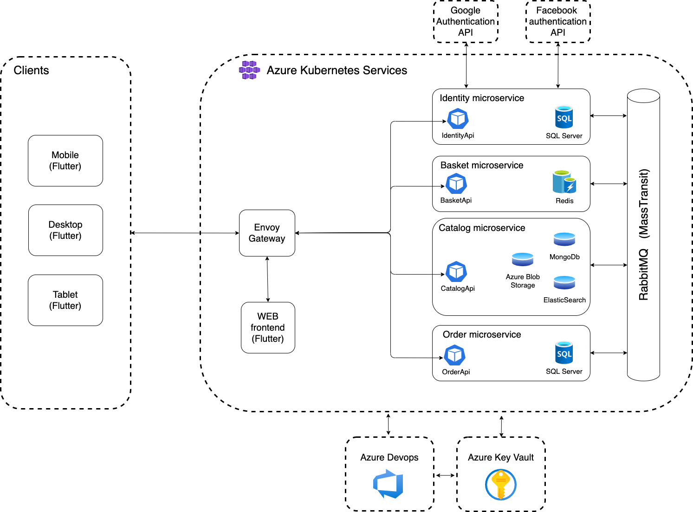

# Microservice architecture demo

Microservice architecture project for learning and testing. All components / modules are not added.

## Target architecture (not ready!)


## Frontend
* Flutter Web / iOS / Android

## Backend
* ASP.NET
* Mediator
* Automapper
* CQRS
* Clean Architecture
* Microservices
* Google and Facebook authentication
* JWT
* Polly
* MassTransit integration events and Sagas

## CI/CD
* Azure Devops pipelines

## Infrastructure
* Terraform
* Azure (AKV, AKS, ACI, ACR)
* SQL Server
* Envoy Gateway
* Docker
* RabbitMQ
* Kustomize
* Elastic Search
* Redis

## Monitoring
* Prometheus
* Linkerd
* ElasticSearch and Kibana to analyze logs

## Test

* Unit testing with xUnit
* Integration testing with xUnit, SQL and in memory database 
* UI testing with Flutter

## Deployment
* Azure Kubernetes Services
* Azure Container Instances
* Azure App Services
* Kind
* Docker-compose
* Local development with VS Code

## Tips and Tricks

Create docker image
```bash
docker build -t microservice_demo/order-api:latest -f src/modules/order/backend/Dockerfile .
docker build -t microservice_demo/identity-api:latest -f src/modules/identity/backend/Dockerfile .
```
Update migrations
```bash
dotnet ef migrations add "Initial" --project src/modules/order/backend/Order.Infrastructure --startup-project src/modules/order/backend/Order.Api
```

Run envoy
```bash
 docker build -t microservice_demo/gateway -f src/gateway/Dockerfile .
 docker run  -p 9901:9901 -p 10000:10000 microservice_demo/gateway

 Open RabbitMQ management console: http://localhost:15672
